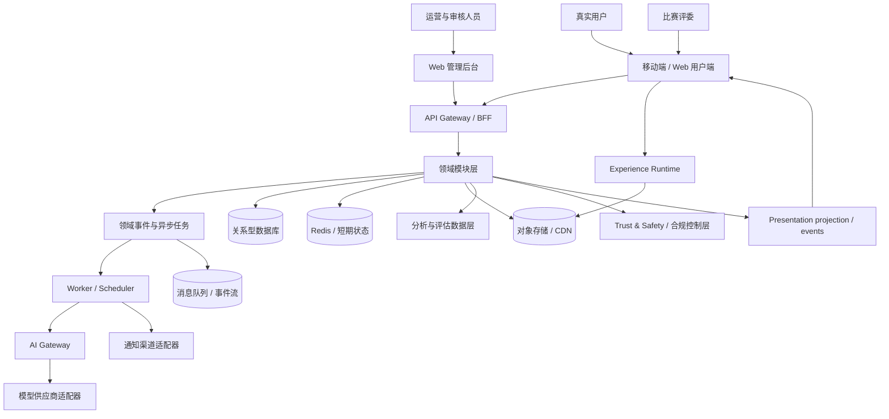
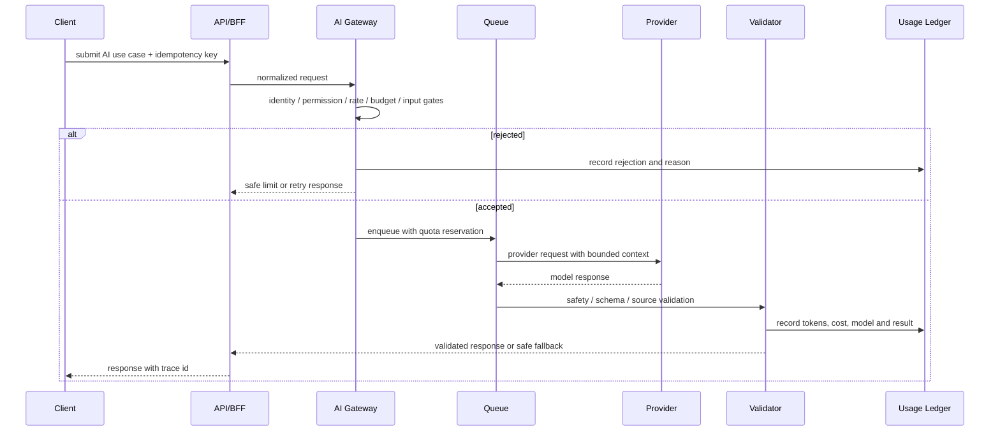

# 「砺境」生产级技术架构与 3A 视觉架构设计

**版本：** v1.0  
**日期：** 2026-08-31  
**状态：** 设计评审稿  
**适用范围：** 面向中国大陆真实用户上线，同时满足国家级创新创业类比赛的产品展示、试点运营和数据举证需求

## 1. 设计目标

「砺境」不是一套只用于答辩的视觉 Demo，而是一款可以从小规模试点逐步扩展到真实用户运营的 RPG 游戏化 AI 学习平台。本架构同时解决四类问题：

1. 学习、题库、复习、AI、成长等功能可以持续增加而不互相污染。
2. 比赛现场可以快速展示完整体验，真实用户也能使用同一套产品能力。
3. 3A 级视觉集中在高价值体验节点，不牺牲题目、计划和错题流程的可用性。
4. AI Token 消耗、恶意刷接口、数据泄露、内容错误和运营事故必须可限制、可追踪、可止损。

### 1.1 已确认的产品约束

- 产品形态：移动端主产品 + Web 可用端 + 独立管理后台。
- 用户区域：首期主要面向中国大陆用户。
- 上线目标：真实部署、真实用户、持续运营。
- 比赛目标：国家级奖项，不把功能数量或视觉包装作为唯一目标。
- 初期容量基线：3 个月 1 万注册用户、1000 DAU，并按约 10 倍余量规划关键资源。
- 视觉目标：启动序列、职业选择、世界地图、战斗反馈、Boss 战、角色和助手达到 3A 风格的沉浸感；学习内容页保持清晰和低干扰。
- 产品红线：不以在线时长作为核心战力，不用付费购买知识掌握，不用抽卡赌博和实时 PVP 制造焦虑。

### 1.2 非目标

首期不做完整微服务平台、全量即时社交、复杂实时战斗、全量就业大陆、开放式用户生成内容直发，以及让 Unity/Unreal 承担整个学习客户端。上述方向保留扩展接口，但不成为首期核心依赖。

## 2. 总体架构决策

### 2.1 推荐方案

采用“**跨端统一用户端 + 独立运营后台 + 模块化单体后端 + 独立 3A 表现层**”的方案。

- 用户端：以 Flutter/Dart 作为统一客户端技术基线，使用一套业务与视觉组件代码覆盖 iOS、Android 和 Web 用户端。
- 管理端：以 React/Next.js/TypeScript 作为独立 Web 管理后台基线，服务题库、审核、运营、客服、数据分析和权限管理。
- 后端：以 TypeScript/NestJS 作为模块化单体技术基线；模块内部高内聚，模块之间通过明确接口和领域事件协作。
- 数据：关系型数据库保存业务事实，缓存保存短期状态，对象存储保存图片、音频和附件，事件流保存可追溯的行为记录。
- AI：所有模型调用经过服务端 AI Gateway，客户端永远不持有模型供应商密钥。
- 视觉：业务状态驱动表现状态；视觉运行时不直接读写业务数据库。

### 2.2 为什么不首期微服务化

初期用户量和团队规模不足以证明拆分服务的收益。首期采用模块化单体可以保留清晰边界，同时减少部署、链路追踪、事务一致性和本地开发复杂度。未来某一模块出现独立扩缩容、独立发布、独立合规或独立团队维护的真实需求时，再按模块边界拆出服务。

### 2.3 为什么不把 3A 视觉做成整套游戏引擎客户端

学习计划、题目、错题、权限、提醒、相机上传、账户、支付和无障碍都属于高频业务界面。把它们全部放进游戏引擎，会增加输入、数据绑定、可测试性、包体、推送和版本发布的复杂度。更稳妥的做法是让产品客户端拥有独立的 Experience Runtime，在少数场景调用高质量动画、2D/2.5D 场景或可替换的 3D 场景模块。

## 3. 分层架构



### 3.1 客户端层

客户端分为四个相互隔离的区域：

1. **App Shell**：路由、登录、主题、权限、网络状态、版本升级、错误恢复。
2. **Study Runtime**：计划、知识点、题目、复习、错题、测试等学习流程。
3. **RPG Runtime**：角色、关卡、怪物、Boss、经验、金币、称号、奖励等成长反馈。
4. **Experience Runtime**：启动序列、世界地图、职业选择、战斗演出、粒子、音频、触感和动画编排。

Study Runtime 和 RPG Runtime 只消费领域服务返回的状态，不自行计算掌握度、奖励或战力。Experience Runtime 只接收已经确认的表现事件，例如 `QuestCompleted`、`BossDefeated` 和 `LevelUp`，避免动画完成与业务结算不一致。

### 3.2 接口层

- 所有客户端只通过版本化 API 访问服务端。
- 首期采用 REST/JSON 为主，实时能力仅用于确有必要的通知或状态刷新。
- 所有请求带 `request_id`、客户端版本、设备标识摘要和幂等键。
- API 契约由 OpenAPI/JSON Schema 管理，客户端生成模型或适配层，不允许散落字符串字段。
- API 只暴露用例，不暴露数据库表结构；例如使用 `completeQuest`，不允许客户端直接提交经验值。
- 破坏性变更通过新版本或兼容字段完成，旧版本保留明确的下线日期。

### 3.3 领域模块层

每个模块拥有自己的数据表、应用服务、领域规则、输入校验、事件和测试。跨模块不得直接修改对方的数据表。

| 模块 | 主要职责 | 允许依赖 |
|---|---|---|
| Identity | 账户、登录、设备、会话、角色权限、组织/租户上下文 | 基础设施、合规 |
| Policy & Configuration | 功能开关、额度、规则版本、风控策略、运营配置 | 基础设施、审计 |
| User Profile | 用户目标、考试日期、学习偏好、属性测评 | Identity |
| Exam & Knowledge | 考试、科目、章节、知识点、知识图谱 | 基础设施 |
| Content | 题目、答案、解析、课程、版权来源、内容版本 | Exam & Knowledge |
| Assessment | 测评、答题尝试、正确率、测试报告 | Content、Exam & Knowledge |
| Mastery | 掌握度、薄弱点、知识点状态迁移 | Assessment |
| Review | 遗忘曲线、复习任务、巩固次数、调度 | User Profile；消费 `MasteryUpdated` 事件 |
| Planning | 每日计划、时间块、阶段比例、动态调整 | User Profile、Mastery、Review |
| Quest & Boss | 任务、关卡、怪物、Boss、通关状态 | Content、Assessment、Mastery |
| Progression | EXP、等级、属性、称号、奖励结算 | Quest & Boss、Mastery |
| Economy | 金币、体力、道具、付费权益、账本 | Progression、Identity |
| AI Gateway | 模型路由、Token 配额、调用审计、内容安全 | Identity、Policy & Configuration；消费安全策略接口 |
| Recommendation | 规则推荐、课程推荐、学习路径推荐 | Content、Mastery、User Profile |
| Notification | 站内信、推送、提醒、静默时间、频控 | User Profile、Planning |
| Analytics & Evidence | 学习事件、实验、留存、效果指标、比赛材料 | 所有只读事件 |
| Trust & Safety | 风控、举报、审核、黑名单、审计、安全策略 | Identity、Content；消费 AI 与行为事件 |
| Social | 好友、组队、公会、排行榜，后续启用 | Identity、Progression |
| Career | 就业大陆、简历、面试、offer，后续启用 | User Profile、AI、Content |
| Billing | 月卡、皮肤、订单、权益，后续启用 | Identity、Economy |

### 3.4 模块通信规则

同步调用只用于需要立即得到结果的查询或短事务；耗时、可重试、可批处理的动作使用领域事件和异步任务。掌握度模块只消费答题评估结果并发布 `MasteryUpdated`；复习模块消费该事件后创建复习任务，避免掌握度与复习调度形成循环依赖。AI Gateway 只读取 Trust & Safety 暴露的策略接口并消费安全事件，不直接依赖风控实现；风控模块通过事件观察 AI 行为和结果。

领域事件统一包含：

```text
event_id
event_type
event_version
aggregate_type
aggregate_id
actor_id
request_id
occurred_at
schema_version
payload
```

首期核心事件包括：

- `AssessmentSubmitted`
- `QuestionAttemptRecorded`
- `MasteryUpdated`
- `ReviewScheduled`
- `QuestStarted`
- `QuestCompleted`
- `BossDefeated`
- `RewardGranted`
- `LevelUp`
- `AiRequestAccepted`
- `AiRequestRejected`
- `AiResponseCompleted`
- `ContentReported`
- `NotificationDispatched`

事件必须可重放、可去重、可追踪。任何奖励、战力、复习和统计都不能以客户端上报的最终数值为准，而要由服务端基于事件和规则重新计算。

## 4. 核心数据设计原则

### 4.1 数据事实与展示投影分离

- **事实数据**：答题尝试、知识点掌握度、复习完成、奖励账本、用户同意记录、AI 调用记录。
- **展示投影**：角色面板、今日任务卡、排行榜、世界地图进度、比赛大屏数据。

事实数据只追加或通过受控状态机迁移；展示投影可以重建。这样可以修复统计错误而不篡改学习事实。

### 4.2 关键状态机

#### 知识点掌握状态

`NEW -> LEARNING -> PRACTICED -> MASTERED -> DECAYING -> REVIEW_DUE -> MASTERED`

永久掌握不是 UI 标记，而是由复习次数、间隔、正确率和稳定性规则共同判定。规则版本必须记录在结果上，未来调整算法时可解释历史数据。

#### 题目尝试状态

`STARTED -> ANSWERED -> EVALUATED -> REVIEWED`

同一次答题只能结算一次；重试必须产生新的尝试记录，不允许覆盖旧答案。

#### 奖励账本

EXP、金币、体力和道具都使用服务端账本。每一笔变更包含来源事件、规则版本、变更前后余额和幂等键。余额不是由客户端计算，也不能通过重复请求叠加。

### 4.3 内容版本与版权

每道题、解析、课程卡片和知识点都必须有：来源、版权状态、审核状态、版本号、适用考试、知识点标签和发布时间。已被用户使用的内容不直接覆盖，修订生成新版本，旧版本保留审计引用。

AI 生成题不能直接进入真题层或 Boss 层。进入用户可见题库前必须经过结构校验、答案验证、知识点匹配、难度评估、抽检或人工审核，并保留生成模型、Prompt 版本和审核结果。

## 5. AI 安全与 Token 成本控制

AI 是高风险和高成本边界，任何模块都不能直接调用外部模型。所有请求必须经过 AI Gateway。

### 5.1 AI Gateway 责任

- 模型供应商适配与路由。
- Prompt 模板版本化，系统指令与用户输入严格分离。
- 输入长度、输出长度、附件大小和上下文窗口限制。
- 用户、设备、IP、功能、模型和全局多级限流。
- Token 预估、实际消耗、费用估算和预算扣减。
- 请求幂等、缓存、去重、超时、重试和熔断。
- 敏感信息脱敏、内容安全检查和输出后处理。
- 全链路审计，但日志默认不保存完整敏感原文。
- 模型下线、供应商切换、紧急关闭和模板回滚。

### 5.2 防止大量刷 Token 的控制链

每次 AI 请求依次通过以下闸门：

1. **身份闸门**：账户状态、设备状态、登录年龄、风险等级和是否完成必要验证。
2. **权限闸门**：用户是否有权使用该 AI 功能，免费权益、付费权益和内部测试权限分开计算。
3. **频率闸门**：账户、设备、IP、功能和全局并发分别执行令牌桶/滑动窗口限流。
4. **预算闸门**：检查单次 Token 上限、日额度、月额度、功能预算和全局预算。
5. **输入闸门**：限制文本长度、图片数量、图片像素、文件类型和上下文条数。
6. **重复闸门**：对规范化后的请求做短期指纹，拦截重复提交和并发重复请求。
7. **队列闸门**：低优先级任务进入队列，限制每用户和全局 worker 并发。
8. **输出闸门**：检查格式、敏感内容、是否越权、是否包含未经验证的答案结论。
9. **结算闸门**：只有成功完成并通过校验的请求才计入权益；所有请求都写入成本审计。

初始策略使用配置驱动，不把额度写死在客户端：新账户低额度、异常账户自动降级、普通用户按功能分配额度，超过预算返回可理解的限额提示而不是无限重试。额度、窗口、模型、输出长度和降级策略必须可以在后台调整，并且调整会留下审计记录。

上线保护值先采用以下安全默认值，经过成本预算、压测和小范围试点后再调整：

| 范围 | 默认保护值 | 说明 |
|---|---:|---|
| 新账户前 24 小时 | 每日最多 5 次 AI 请求 | 防止批量注册立刻消耗预算 |
| 普通账户 | 每日最多 20 次 AI 请求 | 由功能额度和权益策略覆盖 |
| 突发频率 | 10 分钟最多 3 次 | 账户、设备、IP 分别计算 |
| 单用户并发 | 1 个进行中的请求 | 其他请求排队或直接返回可重试提示 |
| 单次输入 | 最多 4,000 Token | 超出部分要求用户缩短或分段提交 |
| 单次输出 | 最多 1,000 Token | 优先使用行动导向的短回答 |
| 图片识题 | 每次最多 2 张、每张不超过 5 MB | 先压缩、扫描和 OCR，再调用模型 |
| 复杂视觉/长文任务 | 默认每日 3 次，优先异步处理 | 与普通问答分开计费和限流 |

以上是服务端策略的起始值，不是用户承诺的永久额度。后台可以按用户权益、风控等级、成本预算和活动窗口调整，但任何放宽都必须有审批、有效期和审计记录。

AI 功能按成本和风险分为四级：

- `L0`：模板、规则和本地知识检索，优先用于提醒、进度查询和简单引导。
- `L1`：短上下文模型问答，用于概念解释、错题提示和学习方法建议。
- `L2`：图片识题、长上下文和多步骤分析，默认更严格限流并优先异步。
- `L3`：批量出题、内容重写和大规模评估，只能由审核后台或受控任务触发，不能由普通用户直接批量调用。



### 5.3 可靠性规则

- 单请求最多一次有限重试，且只对明确的瞬时错误重试。
- 禁止无上限重试、递归调用和“失败后自动再次提问”。
- Provider 超时进入熔断，自动切换模板回答、低成本模型或稍后处理。
- AI 生成题采用离线/异步批处理，不让用户请求直接触发高成本批量出题。
- 图片识题先压缩、去 EXIF、做恶意文件检查，再进入 OCR/模型链路。
- AI 上下文只注入完成脱敏和字段白名单的数据，不把整张用户档案或整库内容交给模型。
- AI 工具调用采用白名单；用户输入、上传内容和检索内容都视为不可信指令，不能改变系统权限或调用任意工具。
- 重要答案必须关联内容版本、题目来源和验证状态；不确定时明确标记并引导用户举报或查看权威解析。

### 5.4 AI 调用账本

`ai_usage_ledger` 至少记录：

- `request_id`、`user_id`、`device_id_hash`、`feature`
- 模型供应商、模型名、模型版本、Prompt 版本
- 输入 Token、输出 Token、估算成本、实际成本
- 是否命中缓存、是否降级、是否触发限流
- 安全检查结果、审核状态、响应耗时
- 关联的业务对象，例如题目、知识点或任务

账本是风控和比赛成本证明的一部分，不能只依赖供应商账单。

### 5.5 AI 与平台安全威胁模型

| 威胁 | 主要控制 | 发现与响应 |
|---|---|---|
| 刷 Token / 批量注册 | 多级限流、设备/IP 风险、账户冷启动额度、全局预算、单用户并发上限 | 成本峰值告警、自动降级、冻结高风险功能、保留调用账本 |
| 提示词注入 / 越权工具调用 | 系统指令与用户输入隔离、工具白名单、RAG 来源白名单、无数据库直连 | 安全样本回归、拦截日志、人工复核、Prompt 版本回滚 |
| 账号接管 / 验证码滥用 | 短时效验证码、重试上限、设备绑定风险、会话轮换、异常登录二次验证 | 登录风控、会话撤销、强制重新验证 |
| 奖励伪造 / 请求重放 | 服务端状态机、幂等键、服务端时间、账本结算、事件去重 | 异常奖励审计、冻结结算、账本修复工具 |
| 恶意上传 / SSRF / 文件炸弹 | MIME 嗅探、大小/像素限制、病毒扫描、私有对象存储、外链白名单、解析沙箱 | 隔离区、扫描失败自动拒绝、人工取证 |
| UGC 或 AI 内容投毒 | 待审核状态、版权声明、来源追踪、抽检、举报和下架 | 内容版本回滚、扩散范围查询、批量下架 |
| 个人信息泄露 | 字段分级、最小权限、加密、脱敏日志、私有网络、导出/删除流程 | 访问审计、异常下载告警、密钥轮换、事件响应 |
| 依赖与供应链攻击 | 锁定依赖、漏洞扫描、SBOM、签名构建、密钥不入库 | CI 阻断、依赖回滚、构建产物核验 |
| DDoS / 接口滥用 | CDN/WAF、请求体限制、边缘限流、熔断、静态资源分离 | 流量告警、封禁策略、只读降级页 |
| 管理员误操作 / 内部滥权 | MFA、RBAC、双人审批、危险操作二次确认、全量审计 | Break-glass 账号、操作回放、权限临时收回 |

### 5.6 认证与会话安全

- Web 使用 `HttpOnly`、`Secure`、`SameSite` Cookie，不把长期 Token 放入 `localStorage`。
- 移动端使用短时效访问凭证和轮换刷新凭证，存入操作系统安全存储。
- 验证码、密码重置和高风险操作都有过期时间、尝试次数和设备/IP 频控。
- 管理后台强制 MFA、最小权限和高危操作二次确认；审计日志不可由普通管理员删除。
- API 统一做输入校验、请求体限制、CORS 白名单、CSRF 防护、SQL 参数化和 SSRF 防护。
- 访问令牌、密钥、模型凭证和第三方回调密钥放入密钥管理系统，定期轮换，不进入代码、日志和客户端包。

## 6. 用户安全、内容安全与运营规范

### 6.1 用户规则体系

上线前必须有可版本化的：用户协议、隐私政策、AI 使用说明、社区/UGC 规则、内容举报规则、账号注销说明和付费权益说明。用户同意记录包含版本、时间、区域、客户端版本和必要的撤回状态。

用户可以查看、修改、导出和删除可操作的个人资料；账号注销进入可审计的删除/匿名化流程，而不是只在前端隐藏入口。

### 6.2 AI 助手行为边界

- 不冒充真人，不诱导用户形成依赖，不通过羞辱、恐吓、内疚或损失威胁督促学习。
- 情绪支持以陪伴和行动建议为主，遇到自伤、他伤、极端危险等信号时进入安全响应流程，不继续游戏化刺激。
- 不提供违法、危险、作弊、考试泄题或侵犯隐私的帮助。
- 不因用户的性别、地域、家庭、经济状况或其他非必要特征改变学习机会和奖励。
- 推荐结果提供简单原因、反馈入口和关闭个性化推荐的能力。
- AI 输出必须标记来源类型：系统课程、人工内容、AI 辅助、用户上传或混合内容。

### 6.3 内容与 UGC 安全

用户上传的题目、错题和图片先进入隔离区，经过文件安全检查、文本/图片审核、版权声明和人工抽检后才可进入公共内容池。举报、下架、申诉、恢复和审核决定全部留存审计记录。

### 6.4 反作弊与游戏经济安全

- 服务端生成任务完成、经验、金币和体力结果。
- 客户端只提交动作，不提交奖励结果。
- 每个动作使用幂等键和服务端时间，防止重复结算和改设备时间。
- 关键事件保留来源、设备摘要、网络风险、客户端版本和规则版本。
- 异常高频答题、极短完成时间、重复答案模式和多账号设备聚集进入风控队列。
- 排行榜、组队和奖励使用延迟结算与异常剔除，不做实时奖励发放。

### 6.5 上传、网络与客户端安全

- 用户上传使用短时效预签名地址，默认私有读；业务 API 不接受任意外链作为可信资源。
- 服务端重新校验文件类型、扩展名、实际 MIME、大小、像素、压缩炸弹和恶意脚本；解析与 OCR 在隔离 worker 中执行。
- Web 端启用安全响应头、严格 CORS 白名单、CSRF 防护和内容安全策略；移动端不在日志中输出设备敏感信息。
- 所有关键动作都返回 trace ID，用户反馈和客服工单可以关联到请求、版本、设备和规则，但不会暴露内部密钥或完整个人数据。
- 客户端版本过旧或存在高危漏洞时，服务端可以限制高风险功能并引导升级。

## 7. 中国大陆上线的工程预留

这些内容属于上线核对项，最终由具备资质的专业人员根据具体业务形态确认：

- 域名、网站和应用相关备案/登记流程。
- 个人信息最小化、目的限定、访问控制、保留期限、删除和导出能力。
- AI 模型供应商、服务形态、内容标识、日志留存和必要公示信息。
- 个性化推荐的解释、关闭和策略审计能力。
- 真题、课程、图片、音频、字体和角色素材的授权链。
- 未成年人或低龄用户进入后的安全模式与默认限制。
- 第三方 SDK 清单、权限调用、隐私弹窗和供应商数据流向。

工程上默认采用境内可部署的基础设施、可替换的模型适配器和可审计的数据流；跨境数据和境外 SaaS 依赖不作为首期默认路径。

架构依据需要持续对照正式法规和主管部门公告，至少包括《中华人民共和国个人信息保护法》、互联网信息服务算法推荐管理相关规定、生成式人工智能服务管理相关规定及人工智能生成合成内容标识相关要求。这里的文档只定义工程控制点，不替代上线前的专业合规审查。

## 8. 3A 视觉与 UI 架构

### 8.1 视觉定位

「砺境」的视觉不是“游戏皮肤覆盖学习工具”，而是让学习行为拥有可感知的世界、角色和反馈。核心体验分为两层：

- **沉浸层**：启动序列、职业选择、世界地图、怪物出现、Boss 战、升级和章节通关。
- **效率层**：任务、题目、解析、错题、复习、课程和 AI 对话。

沉浸层负责记忆点和情绪，效率层负责学习结果。两层共享品牌语言，但不共享所有交互密度。

### 8.2 Experience Runtime

Experience Runtime 由以下适配器组成：

- `SceneHost`：承载地图、章节和战斗场景。
- `AssetCatalog`：按版本、分辨率、主题和职业加载资源。
- `AnimationOrchestrator`：根据表现事件编排动画，不修改业务状态。
- `CharacterPresentation`：角色、助手、表情、动作和装备外观。
- `AudioBus`：BGM、环境音、提示音和静音策略。
- `HapticAdapter`：移动端触感，Web 端降级为空实现。
- `PerformancePolicy`：低端设备、弱网、省电、减少动画和无障碍模式。
- `AccessibilityAdapter`：文字替代、焦点顺序、对比度、字幕和关闭动态效果。

视觉引擎可以使用 Rive、Lottie、Spine、Canvas/WebGL 或未来独立的 3D 场景模块，但业务模块只依赖 `PresentationEvent` 和 `AssetId`，不依赖具体供应商。

### 8.3 资源管线

每个资源经过：原始文件 -> 命名与版权登记 -> 艺术审核 -> 多尺寸/多格式导出 -> 压缩 -> 清单登记 -> CDN 发布 -> 客户端预加载 -> 运行时回收。

资源清单包含资源 ID、版本、尺寸、格式、版权来源、适用场景、最低客户端版本、降级资源和哈希。资源不得以不可追踪的临时 URL 写死在业务代码中。

### 8.4 视觉性能底线

- 题目和答题流程优先保证可读性、点击响应和弱网可用。
- 启动序列和 Boss 演出可以加载更高质量资源，但必须有跳过、静音、低动效和低清资源路径。
- 关键业务操作不能等待完整动画结束才提交；动画是业务确认后的表现，不是事务本身。
- 高质量资源按场景懒加载并可回收，避免打开一次世界地图就长期占用内存。
- 所有大屏展示必须有专门的演示模式，但演示模式不得伪造用户学习数据；可以使用明确标记的种子账户或脱敏试点数据。

## 9. 基础设施与部署拓扑

### 9.1 环境

- `local`：本地开发，使用脱敏种子数据和本地依赖适配器。
- `staging`：接近生产配置，用于集成、压测、审核流程和候选版本验收。
- `production`：真实用户环境，严格权限和变更流程。

环境之间的密钥、数据库、对象存储和 AI 预算完全隔离。禁止从生产复制未脱敏数据到本地或测试环境。

### 9.2 生产组件

- CDN/WAF/反向代理：静态资源、基础防护、请求大小限制和访问频控。
- API 应用集群：无状态部署，实例可水平扩展。
- Worker 集群：复习调度、通知、AI 异步任务、内容审核和统计投影。
- 关系型数据库：业务事实、事务和版本数据；启用备份、迁移和只读副本预留。
- Redis：限流计数、短期缓存、会话辅助状态和队列适配；不保存唯一事实。
- 对象存储/CDN：角色、场景、音频、题目图片和用户上传附件；默认私有读。
- 消息队列/事件流：异步任务和领域事件，支持重试、死信和幂等消费。
- AI Gateway：独立预算、并发、模型和审计边界。
- 日志/指标/链路：统一 trace ID；日志禁止写入 Token、密码、完整手机号、完整图片 URL 和完整用户对话原文。

### 9.3 发布与回滚

- 数据库迁移必须向前兼容，先扩展字段/表，再切换读写，最后清理旧结构。
- 新功能通过 feature flag 灰度，按用户、设备、版本和百分比逐步放量。
- AI Prompt、规则、题目和推荐模型都是可回滚版本，不随客户端硬编码发布。
- 发布前运行单元、契约、集成、安全、迁移和关键链路回归测试。
- 出现成本异常、数据异常、AI 质量异常或安全事件时，可以独立关闭 AI 功能、推荐、UGC、社交和付费，而不必整体停服。

## 10. 可观测性、故障与灾备

### 10.1 必备指标

- API 成功率、P95/P99 延迟、超时、5xx、限流和熔断次数。
- 登录、答题、结算、复习调度、奖励发放和通知送达成功率。
- AI 请求量、Token、成本、缓存命中率、拒绝率、降级率和异常峰值。
- 题目正确率异常、答案投诉率、知识点掌握度异常变化。
- 数据库连接、慢查询、锁等待、队列积压、死信和对象存储失败。
- 客户端崩溃、启动成功率、资源加载失败和动画降级率。

### 10.2 事故等级与止损

- P0：数据泄露、奖励/支付大规模错误、AI 成本失控、全站不可用。立即关停受影响功能、保留证据、通知负责人并执行恢复预案。
- P1：核心学习流程大面积失败、题库答案错误扩散、通知或复习调度异常。限制流量、回滚版本、冻结错误内容并修复。
- P2：局部体验问题、单一设备兼容、非核心后台故障。进入工作日修复队列。

任何自动化止损都必须有恢复条件、审计记录和人工复核，不能让风控误杀成为无解释的永久封禁。

### 10.3 备份与恢复

- 关系型数据库定期全量备份和连续增量备份，备份加密并与生产权限隔离。
- 对象存储启用版本和删除保护，重要资源保留历史版本。
- 事件流和 AI 账本按审计要求保留，敏感原文按最小化和期限策略处理。
- 每季度至少进行一次恢复演练，验证 RPO/RTO、密钥恢复、迁移脚本和静态资源可用性。

## 11. 测试与质量门禁

### 11.1 后端

- 领域规则单元测试：掌握度、复习调度、奖励、防重复结算、时间分配和体力规则。
- API 契约测试：移动端、Web 端和管理端共享契约，禁止字段静默变化。
- 集成测试：数据库事务、消息消费、AI Gateway、通知、对象存储和权限。
- 风控测试：重放请求、并发请求、恶意 Prompt、超长输入、刷 Token、伪造客户端奖励。
- 负载测试：登录、答题、每日任务、复习调度、AI 限流和静态资源峰值。

### 11.2 客户端与视觉

- 核心学习流程在主流移动尺寸、桌面浏览器、弱网、离线恢复和低动效模式下验收。
- 视觉场景验收资源加载、跳过、失败降级、内存回收、音频开关和无障碍焦点。
- 所有动画失败不能阻塞业务结算。
- 比赛演示模式只使用可标记的种子数据或脱敏真实数据。

### 11.3 AI 质量

- Prompt 回归集：概念解释、题目解析、方法建议、情绪支持、越权请求、作弊请求和提示注入。
- 题目验证集：答案、解析、知识点、难度、重复度和歧义。
- 每次模型、Prompt、规则或供应商变化都生成可比较的离线评估报告。
- 高风险输出进入人工抽检和用户举报闭环，质量问题可以定位到模型、Prompt、内容版本和用户请求。

## 12. 迭代路线与扩展方式

### 阶段 0：架构与安全基线

完成模块边界、API 契约、数据分类、AI 预算、审计模型、资源清单、权限矩阵和部署环境设计。

### 阶段 1：可运营 MVP

实现三个职业、真题层、知识点打怪、章节 Boss、复习调度、每日任务、基础 AI 助手、公告板、用户反馈和运营后台。以真实用户可完成学习闭环为验收标准。

### 阶段 2：质量与留存

加入 AI 生成题审核流水线、课程推荐、资源商店、助手亲密度、实验平台和学习效果报告。先验证掌握度和留存，再扩展游戏内容。

### 阶段 3：社交与内容生态

启用 UGC、好友、组队、公会和排行榜。所有社交模块必须复用 Identity、Trust & Safety、Progression 和 Analytics 的边界，不另起一套用户、奖励和举报系统。

### 阶段 4：就业大陆与 B 端

Career 作为独立领域模块接入，不修改学业大陆的核心掌握度模型；学校/机构版通过租户、组织、角色和数据隔离扩展，不把 B 端字段直接塞进个人用户表。

## 13. 架构红线

1. 客户端不持有 AI、数据库、对象存储或支付供应商密钥。
2. 客户端不决定掌握度、战力、经验、金币、体力和通关结果。
3. 业务模块不直接读写其他模块的数据表。
4. AI 请求不允许无限重试、无限上下文和用户端批量触发高成本生成。
5. 用户上传内容不直接公开；真题和课程不使用无授权来源。
6. 日志不记录密码、Token、完整个人信息和不必要的完整对话原文。
7. 动画、音效、3D 场景和资源加载不能阻塞学习事务。
8. 线上规则、Prompt、题目、推荐和资源都必须有版本、审计和回滚能力。
9. 付费不购买知识掌握和 Boss 通关，不能通过支付绕过学习结果。
10. 比赛演示必须可解释、可追溯、标记真实数据来源，不伪造用户效果。

## 14. 评审结论

本架构将「砺境」定义为：

> 一个以学习事实为核心、以领域事件连接成长反馈、以 AI Gateway 控制智能能力、以独立 Experience Runtime 承载 3A 视觉、以安全和可观测性支撑真实运营的跨端学习平台。

后续新增功能的判断标准只有三个：

1. 是否有明确的领域归属和数据所有者。
2. 是否通过版本化接口/事件接入，而不是跨模块写表。
3. 是否包含权限、成本、审计、回滚和异常降级路径。

满足这三个条件，才进入实现计划。
